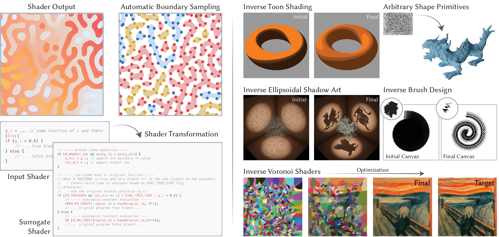

# Automatic Sampling for Discontinuities in Differentiable Shaders

**Yash Belhe, Ishit Mehta, Wesley Chang, Iliyan Georgiev, Michaël Gharbi, Ravi Ramamoorthi, Tzu-Mao Li**  
SIGGRAPH Asia 2025 (Journal Track) - Best Paper Award!

[Project Website](https://yashbelhe.github.io/asd/index.html) · [Paper PDF](https://cseweb.ucsd.edu/~ravir/ybelhesiga25.pdf) · [Video](https://cseweb.ucsd.edu/~ravir/ybelhesiga25.mp4)



We introduce automatic boundary sampling for discontinuities in differentiable shaders. Rather than writing specialized boundary queries for every primitive, our method transforms shaders into surrogate, piecewise-constant programs and samples discontinuities by snapping segments to discontinuities. This repository contains the Slang/PyTorch re-implementation for the experiments in the paper.

## Getting Started

### Prerequisites

* Linux with CUDA-capable GPU (tested with CUDA 12.x); not tested on other operating systems.
* [Conda](https://docs.conda.io/en/latest/) or [Miniforge](https://github.com/conda-forge/miniforge)  
* A recent NVIDIA driver that matches your CUDA toolkit

### Environment setup

```bash
git clone https://github.com/yashbelhe/auto_disc_sample.git
cd auto_disc_sample
conda env create -f environment.yml
conda activate asd
export CUDA_HOME=/usr/local/cuda      # adjust if CUDA is installed elsewhere
export PATH="$CUDA_HOME/bin:$PATH"
```

The environment installs PyTorch, SlangTorch, PyKeOps (for KDE-based boundary sampling), and the visualization stack (Matplotlib, Pillow, ImageIO). If you prefer a different CUDA toolkit, adjust the versions inside `environment.yml` accordingly.

### Shader compilation cache

Examples compile the required Slang shaders on first run via `compiler/compile_shader.py`. The generated files (with `__gen__` prefixes) are stored under `slang/` and re-used on subsequent runs. Delete them if you need to force recompilation after modifying a shader.

Note: The compiler has been recently refactored and my have some bugs! Please raise a GitHub issue if you encounter one.

## Running Examples

All commands assume you are in the repository root with the `asd` environment active.

1. **Vector-graphics circle fitting (Slang + automatic boundary loss)**

   ```bash
   python python/examples/vector_graphics_circle_fit.py \
     --image scream \
     --num-circles 100
   ```

2. **Painterly rendering**

   ```bash
   python python/examples/painterly_rendering.py \
     --image starry \
     --primitive line \
     --n 30
   ```

   Generates stylized renderings with differentiable vector graphics primitives. Results are written under `results/painterly/`.

### Full example command list

Every script under `python/examples/` exposes CLI flags via `--help`. Minimal invocation commands are listed below for completeness:

| Script | Sample command | Notes |
| --- | --- | --- |
| `binary_fit.py` | `python python/examples/binary_fit.py --image data/diamond_input.png` | Binary grid fitting demo. |
| `cel_shading.py` | `python python/examples/cel_shading.py --num-iter 400` | Optimizes cel-shading shader parameters. |
| `csg_opt.py` | `python python/examples/csg_opt.py` | CSG gradient optimization with boundary loss. |
| `ellipsoid_rasterizer_opt.py` | `python python/examples/ellipsoid_rasterizer_opt.py --scene bunny --num-iter 200` | Multi-view ellipsoid fitting. |
| `gaussian_mixture_fit.py` | `python python/examples/gaussian_mixture_fit.py --image scream --train-resolution 256 --save-resolution 512` | Pure PyTorch Gaussian blobs. |
| `grad_bezier.py` | `python python/examples/grad_bezier.py` | Gradient check for quadratic Bezier shader. |
| `grad_circle_single.py` | `python python/examples/grad_circle_single.py` | Gradient check for single circle shader. |
| `grad_circles.py` | `python python/examples/grad_circles.py` | Multi-circle gradient test. |
| `grad_half_plane.py` | `python python/examples/grad_half_plane.py` | Half-plane shader gradient verification. |
| `grad_triangle.py` | `python python/examples/grad_triangle.py` | Triangle shader gradient verification. |
| `grad_voronoi.py` | `python python/examples/grad_voronoi.py` | Voronoi shader gradient check. |
| `implicit_raymarching.py` | `python python/examples/implicit_raymarching.py --num-iter 200` | Inverse implicit ray-marching setup. |
| `inverse_swept_surface_2d.py` | `python python/examples/inverse_swept_surface_2d.py --num-iter 400` | 2D swept surface inversion. |
| `painterly_rendering.py` | `python python/examples/painterly_rendering.py --image starry --primitive line --n 30` | Painterly vector graphics optimization. |
| `swept_surface_2d.py` | `python python/examples/swept_surface_2d.py --num-iter 200` | Forward swept-surface rendering. |
| `triangle_rasterizer_opt.py` | `python python/examples/triangle_rasterizer_opt.py --num-iter 200` | Triangle rasterizer optimization. |
| `trilinear_threshold_opt.py` | `python python/examples/trilinear_threshold_opt.py --num-iter 400` | 3D threshold field fitting. |
| `vector_graphics_circle_fit.py` | `python python/examples/vector_graphics_circle_fit.py --image scream --num-circles 100` | Circle-only vector graphics fitting. |
| `voronoi_opt.py` | `python python/examples/voronoi_opt.py --image scream --grid-size 30` | Voronoi mosaic optimization. |


## Repository Layout

| Path | Description |
| --- | --- |
| `python/examples/` | Standalone optimization demos (Slang and PyTorch). |
| `python/utils/` | Boundary sampling utilities, camera helpers, IO, and Slang runtime bindings. |
| `slang/` | Differentiable shader kernels. Generated shaders share the same directory with a `__gen__` prefix. |
| `compiler/` | Tools for compiling Slang to CUDA kernels through SlangTorch. |
| `results/` | Default output directory for examples. |

## Citation

If you use this codebase in academic work, please cite:

```
@article{Belhe:2025:AutomaticSamplingDiscontinuities,
  author = {Yash Belhe and Ishit Mehta and Wesley Chang and Iliyan Georgiev and Micha\"{e}l Gharbi and Ravi Ramamoorthi and Tzu-Mao Li},
  title = {Automatic Sampling for Discontinuities in Differentiable Shaders},
  journal = {ACM Transactions on Graphics (Proceedings of SIGGRAPH Asia)},
  year = {2025},
  volume = {44},
  number = {6},
  doi = {10.1145/3763291}
}
```

## License

Released under the [MIT License](LICENSE). Contributions are welcome via pull requests.
